# DevOps AI - Desktop Automation Agent

A **DevOps AI agent** with full desktop automation capabilities. This system combines intelligent log analysis with autonomous task execution, file operations, terminal commands, and desktop control.

## 🎯 Overview

### DevOps AI Agent Features

- **Autonomous Task Execution** - AI plans and executes multi-step tasks
- **Desktop Automation** - Control browsers, take screenshots, launch apps
- **File Operations** - Read, write, edit files with AI assistance
- **Terminal Commands** - Execute shell commands with approval workflow
- **Tool-based Architecture** - 17+ tools for various automation tasks
- **Interactive CLI** - Chat-based interface

### Original DevOps Features

- **Monitors** project logs in real-time
- **Detects** and **classifies** failures using pattern matching
- **Analyzes** project configuration for context
- **Proposes** deterministic fixes
- **Generates** structured patch suggestions
- **Stores** historical resolution memory
- **AI-Powered Analysis** via OpenRouter (DeepSeek, Llama, Mistral, Qwen, Gemini)
- **Requests** manual approval before any action

---

## 📊 Architecture Diagrams

### High-Level System Architecture


### User Interaction Flow


### OpenRouter Integration Flow


### Tool Execution Pipeline


### Python Log Analysis Pipeline


### AI Model Selection Flow

```mermaid
flowchart TD
    TASK[Incoming Task] --> ANALYZE{Analyze Content}

    ANALYZE -->|error/exception/traceback| LOG[Log Analysis]
    ANALYZE -->|debug/fix/why| DEBUG[Debugging]
    ANALYZE -->|create/generate/implement| CODE[Code Generation]
    ANALYZE -->|refactor/optimize| REFACTOR[Refactoring]
    ANALYZE -->|document/explain| DOC[Documentation]
    ANALYZE -->|other| GEN[General]

    LOG --> SELECT_R1[Select DeepSeek R1]
    DEBUG --> SELECT_R1
    CODE --> SELECT_V3[Select DeepSeek V3]
    REFACTOR --> SELECT_V3
    DOC --> SELECT_LLAMA[Select Llama 3.1]
    GEN --> SELECT_DEFAULT[Select Default Model]

    SELECT_R1 --> CTX{Check Context}
    SELECT_V3 --> CTX
    SELECT_LLAMA --> CTX
    SELECT_DEFAULT --> CTX

    CTX -->|High Complexity| R1_FINAL[Use DeepSeek R1]
    CTX -->|Speed Critical| MISTRAL_FINAL[Use Mistral 7B]
    CTX -->|Long Log > 30KB| R1_FINAL
    CTX -->|Normal| SELECTED[Use Selected Model]

    R1_FINAL --> CALL[Call LLM]
    MISTRAL_FINAL --> CALL
    SELECTED --> CALL

    CALL --> FAIL{Failed?}
    FAIL -->|Yes| FALLBACK[Try Fallback Chain]
    FALLBACK --> CALL
    FAIL -->|No| DONE[Return Response]

    style TASK fill:#e3f2fd
    style DONE fill:#c8e6c9
```



### Request/Response Cycle


---

## 🏗️ Architecture

### DevOps AI Agent Architecture

```
User Request
      ↓
DevOps AI Agent (Orchestrator)
      ↓
Task Planning & Analysis
      ↓
Tool Selection & Execution
   ├── execute_command (Terminal)
   ├── read_file / write_to_file (File System)
   ├── replace_in_file (Code Edits)
   ├── search_files / list_files (Navigation)
   ├── browser_action (Web Automation)
   ├── screen_capture (Screenshots)
   ├── app_control (Desktop Apps)
   ├── clipboard (Copy/Paste)
   └── ask_followup_question (User Input)
      ↓
LLM Layer (OpenRouter)
   ├── DeepSeek R1 (reasoning)
   ├── DeepSeek V3 (code)
   ├── Qwen 2.5 (fallback)
   ├── Llama 3.1 (documentation)
   └── Mistral 7B (quick tasks)
      ↓
Result & Completion
```

### Core Pipeline (Original)

```
Project Folder
      ↓
Log Watcher Engine
      ↓
Structured Log Parser
      ↓
Error Classifier (Rule-first)
      ↓
Context Analyzer
      ↓
Deterministic Fix Engine
      ↓
Patch Proposal Generator
      ↓
Incident Memory Store
      ↓
Report Builder
```

---

## 📁 Project Structure

```
devops-ai/
├── src/                    # TypeScript AI Integration
│   ├── ai/                 # AI/LLM Layer
│   │   ├── models.ts       # Model registry (20+ models)
│   │   ├── modelRouter.ts  # Smart model selection
│   │   └── openrouterClient.ts  # OpenRouter API client
│   ├── agent/              # Agent orchestration
│   │   ├── accomplishAgent.ts   # Main agent
│   │   ├── devopsAIAgent.ts     # Desktop automation agent
│   │   ├── taskOrchestrator.ts  # Task management
│   │   └── prompts.ts      # Production-grade prompts
│   ├── tools/              # Tool System
│   │   ├── types.ts        # Tool type definitions
│   │   ├── definitions.ts  # Tool descriptions
│   │   ├── executor.ts     # Tool execution engine
│   │   └── index.ts        # Module exports
│   ├── routes/             # API routes
│   │   └── analyze.ts      # Analysis endpoints
│   ├── cli/                # CLI Entry Points
│   │   ├── agent.ts        # Main agent CLI
│   │   ├── cline-cli.ts    # Interactive CLI
│   │   └── index.ts        # Original CLI
│   └── index.ts            # Express server entry
├── analyzer/               # Codebase analysis
├── classifier/             # Error classification
├── fix_engine/             # Fix generation engine
├── memory/                 # Incident memory store
├── parser/                 # Log parsing modules
├── patch/                  # Patch generation
├── reports/                # Report generation
├── watcher/                # Log monitoring
├── logs/                   # Log files to analyze
├── storage/                # Persistent storage
├── main.py                 # Python main entry
├── cli.py                  # Python CLI interface
├── config.py               # Configuration module
├── package.json            # Node.js dependencies
├── tsconfig.json           # TypeScript config
└── requirements.txt        # Python dependencies
```

---

## 🚀 Quick Start

### Prerequisites

- Node.js 18+
- Python 3.8+ (optional, for Python pipeline)
- OpenRouter API Key (get one at [openrouter.ai](https://openrouter.ai))

### Installation

```bash
# Clone the repository
git clone https://github.com/SairajMN/DevOps_AI.git
cd DevOps_AI

# Install Node.js dependencies
npm install

# Configure environment
cp .env.example .env
# Edit .env and add your OPENROUTER_API_KEY
```

### Running DevOps AI Agent

```bash
# Start interactive DevOps AI session
npm run agent

# Or run directly with ts-node
npx ts-node src/cli/agent.ts
```

### Running the DevOps AI Server

```bash
# Development mode
npm run dev

# Build and run production
npm run build
npm start
```

---

## 💻 DevOps AI Usage

### Interactive Mode

```bash
npm run agent
```

This starts an interactive chat session where you can:

- Describe tasks in natural language
- Let the AI plan and execute multi-step operations
- Approve or reject actions before execution

### Command Line

```bash
# Execute a task directly
npx ts-node src/cli/agent.ts run "Create a new React component called Button"

# Plan a task without executing
npx ts-node src/cli/agent.ts plan "Set up a new Express.js project"

# Analyze error logs
npx ts-node src/cli/agent.ts analyze logs/error.log

# List available tools
npx ts-node src/cli/agent.ts tools

# Show system status
npx ts-node src/cli/agent.ts status
```

### Example Tasks

```
You: Create a new TypeScript file called utils.ts with common utility functions

You: Fix the TypeScript error in src/index.ts

You: Run the tests and fix any failures

You: Take a screenshot of my desktop

You: Search for all TODO comments in the codebase

You: Analyze the error logs and suggest fixes
```

### CLI Commands

| Command        | Description                   |
| -------------- | ----------------------------- |
| `/help`        | Show help message             |
| `/cd <path>`   | Change working directory      |
| `/status`      | Show current status           |
| `/clear`       | Clear conversation history    |
| `/plan <task>` | Plan a task without executing |
| `exit`         | Exit the CLI                  |

---

## 🔧 Available Tools

### File Operations

| Tool                         | Description                  | Approval Required |
| ---------------------------- | ---------------------------- | ----------------- |
| `read_file`                  | Read file contents           | No                |
| `write_to_file`              | Create or overwrite files    | Yes               |
| `replace_in_file`            | Make targeted edits to files | Yes               |
| `search_files`               | Search for patterns in files | No                |
| `list_files`                 | List directory contents      | No                |
| `list_code_definition_names` | Get code structure overview  | No                |

### Command Execution

| Tool              | Description           | Approval Required |
| ----------------- | --------------------- | ----------------- |
| `execute_command` | Run terminal commands | Yes               |

### Interaction Tools

| Tool                    | Description                    | Approval Required |
| ----------------------- | ------------------------------ | ----------------- |
| `ask_followup_question` | Ask user for clarification     | No                |
| `attempt_completion`    | Present final result           | No                |
| `plan_mode_respond`     | Present plan in plan mode      | No                |
| `new_task`              | Create a new task with context | No                |

### Desktop Automation

| Tool             | Description                     | Approval Required |
| ---------------- | ------------------------------- | ----------------- |
| `browser_action` | Control a web browser           | Yes               |
| `screen_capture` | Take screenshots                | Yes               |
| `app_control`    | Launch and control applications | Yes               |
| `clipboard`      | Interact with system clipboard  | No                |

### Web Tools

| Tool         | Description             | Approval Required |
| ------------ | ----------------------- | ----------------- |
| `web_search` | Search the web          | No                |
| `web_fetch`  | Fetch content from URLs | No                |

---

## 🔌 API Endpoints

### Server runs on `http://localhost:3000` by default

| Endpoint             | Method | Description              |
| -------------------- | ------ | ------------------------ |
| `/`                  | GET    | API info                 |
| `/api/health`        | GET    | Health check             |
| `/api/models`        | GET    | List available AI models |
| `/api/analyze`       | POST   | Full log analysis        |
| `/api/analyze/quick` | POST   | Quick analysis           |
| `/api/analyze/multi` | POST   | Multi-step analysis      |
| `/api/analyze/batch` | POST   | Batch analysis           |
| `/api/fix`           | POST   | Code fix generation      |

### Example API Calls

```bash
# Analyze a log
curl -X POST http://localhost:3000/api/analyze \
  -H "Content-Type: application/json" \
  -d '{"log": "ERROR: Connection timeout at database.py:45"}'

# Quick analysis
curl -X POST http://localhost:3000/api/analyze/quick \
  -H "Content-Type: application/json" \
  -d '{"log": "TypeError: Cannot read property of undefined"}'

# Generate code fix
curl -X POST http://localhost:3000/api/fix \
  -H "Content-Type: application/json" \
  -d '{
    "code": "def add(a, b):\n    return a + b",
    "errorMessage": "TypeError: unsupported operand type",
    "language": "python"
  }'
```

---

## 🤖 AI Models

### Available Models via OpenRouter

| Model ID         | Name               | Best For                           | Context | Free |
| ---------------- | ------------------ | ---------------------------------- | ------- | ---- |
| `deepseek-r1`    | DeepSeek R1        | Reasoning, debugging, log analysis | 64K     | ✅   |
| `deepseek-v3`    | DeepSeek V3        | Code generation, refactoring       | 64K     | ✅   |
| `llama-3.3-70b`  | Llama 3.3 70B      | Complex reasoning, coding          | 131K    | ✅   |
| `llama-3.1-8b`   | Llama 3.1 8B       | Documentation, general tasks       | 131K    | ✅   |
| `mistral-7b`     | Mistral 7B         | Quick fallback, Python/JS          | 32K     | ✅   |
| `qwen-2.5-coder` | Qwen 2.5 Coder 32B | Code generation, debugging         | 32K     | ✅   |
| `gemini-flash`   | Gemini Flash 1.5   | Fast general tasks                 | 1M      | ✅   |
| `gemini-2.0`     | Gemini 2.0 Flash   | Multimodal, coding                 | 1M      | ✅   |
| `phi-4`          | Phi-4              | Reasoning, math, coding            | 16K     | ✅   |
| `claude-3-haiku` | Claude 3 Haiku     | Fast, safe, coding                 | 200K    | ✅   |

### Smart Model Selection

The system automatically selects the best model based on task type:


| Task Type         | Primary Model    | Fallback Chain               |
| ----------------- | ---------------- | ---------------------------- |
| `log-analysis`    | DeepSeek Chat    | Gemini 2.0 Flash → Llama 3.1 |
| `debugging`       | DeepSeek Chat    | Gemini 2.0 Flash → Llama 3.1 |
| `code-generation` | DeepSeek Chat    | Gemini 2.0 Flash → Llama 3.1 |
| `documentation`   | Llama 3.1 8B     | Gemini 2.0 Flash             |
| `quick-fallback`  | Gemini 2.0 Flash | Llama 3.1 8B                 |

### Model Router Logic

```typescript
// Automatic task type detection
function detectTaskType(content: string): TaskType {
  if (content.includes("error:") || content.includes("exception:")) {
    return "log-analysis";
  }
  if (content.includes("debug") || content.includes("fix this")) {
    return "debugging";
  }
  if (content.includes("create") || content.includes("generate")) {
    return "code-generation";
  }
  return "general";
}

// Context-aware model selection
function selectModelWithContext(context: TaskContext): string {
  if (context.complexity === "high" || context.requiresReasoning) {
    return "deepseek/deepseek-r1:free";
  }
  if (context.requiresSpeed) {
    return "mistralai/mixtral-8x7b-instruct:free";
  }
  return selectModel(context.type);
}
```

---

## 🔧 Configuration

### Environment Variables (.env)

```bash
# Required
OPENROUTER_API_KEY=your-key-here

# Server
PORT=3000
HOST=0.0.0.0
NODE_ENV=development

# Optional
LOG_LEVEL=info
DEFAULT_MODEL=deepseek/deepseek-chat
APP_URL=http://localhost:3000
```

### Agent Configuration

```typescript
interface DevOpsAIAgentConfig {
  model: string; // Default: deepseek/deepseek-chat
  max_tokens: number; // Default: 4096
  temperature: number; // Default: 0
  max_iterations: number; // Default: 50
  require_approval: boolean; // Default: true
  auto_execute: boolean; // Default: false
  working_directory: string; // Default: process.cwd()
}
```

---

## 🔒 Security Model

### Risk Assessment Levels


| Risk Level   | Examples                                 | Approval        |
| ------------ | ---------------------------------------- | --------------- |
| **Critical** | `rm -rf`, `format`, `shutdown`           | Always required |
| **High**     | `npm publish`, `git push`, `.env` writes | Always required |
| **Medium**   | Other commands, file modifications       | Configurable    |
| **Low**      | Read operations, search, list            | Not required    |

### Security Features

- ✅ Fully local execution
- ✅ No auto patch application
- ✅ No arbitrary command execution without approval
- ✅ Suggested commands require explicit approval
- ✅ API key stored in environment variables
- ✅ Risk assessment for each tool use
- ✅ Configurable auto-approve mode

---

## 📝 Response Format

### Log Analysis Response

```json
{
  "success": true,
  "analysis": {
    "error_type": "ModuleNotFoundError",
    "error_category": "dependency",
    "root_cause": "Missing psycopg2 module in Python environment",
    "confidence": 92,
    "suggested_fix": "Install psycopg2-binary package",
    "step_by_step_fix": [
      "Run: pip install psycopg2-binary",
      "Or add to requirements.txt",
      "Restart the application"
    ],
    "is_environment_issue": false,
    "is_dependency_issue": true,
    "is_code_issue": false,
    "affected_files": ["database.py"],
    "severity": "high"
  },
  "metadata": {
    "model": "deepseek/deepseek-chat",
    "duration": 2340,
    "attempts": 1
  }
}
```

### Tool Execution Response

```json
{
  "type": "tool_result",
  "tool_use_id": "tool-abc123",
  "content": {
    "stdout": "Build successful",
    "stderr": "",
    "exit_code": 0,
    "duration": 5432,
    "success": true
  },
  "is_error": false
}
```

---

## 🧪 Testing

```bash
# Run TypeScript type check
npm run typecheck

# Start DevOps AI Agent
npm run agent

# Run DevOps AI server
npm run dev

# Check system status
npx ts-node src/cli/agent.ts status

# Test OpenRouter connection
curl http://localhost:3000/api/health
```

---

## 📚 Tech Stack

### TypeScript/Node.js

- **Express.js** - API server
- **Axios** - HTTP client
- **Zod** - Schema validation
- **TypeScript** - Type safety
- **uuid** - Unique IDs

### Python (Optional)

- **asyncio** - Async operations
- **watchdog** - File monitoring
- **Jinja2** - Templating
- **markdown** - Report generation

---

## 🔄 Error Handling & Fallback

### Retry Logic


### Fallback Chain

1. **Primary Model** - Task-specific best model
2. **First Fallback** - Alternative capable model
3. **Second Fallback** - General purpose model
4. **Error** - Return error with details

---

## 🤝 Contributing

1. Fork the repository
2. Create a feature branch (`git checkout -b feature/amazing-feature`)
3. Make your changes
4. Run tests (`npm run typecheck`)
5. Commit changes (`git commit -m 'Add amazing feature'`)
6. Push to branch (`git push origin feature/amazing-feature`)
7. Submit a pull request

---

## 📄 License

MIT License - See LICENSE file for details.

---

## 🙏 Acknowledgments

Built with:

- **AI Models**: DeepSeek, Llama, Mistral, Qwen, Gemini, Claude (via OpenRouter)
- **Runtime**: Node.js + Python
- **Frameworks**: Express, asyncio
- **Inspiration**: The DevOps and AI community

---

## 📞 Support

- **Issues**: [GitHub Issues](https://github.com/SairajMN/DevOps_AI/issues)
- **Discussions**: [GitHub Discussions](https://github.com/SairajMN/DevOps_AI/discussions)
- **Documentation**: This README and inline code documentation
